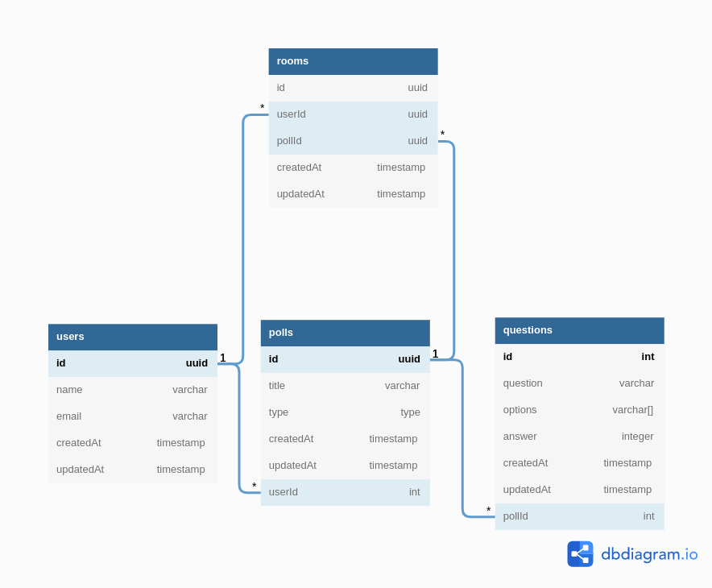

# Server
A backend service for handling api calls.

## Development
### Creating .env file
Create a `.env` file in folder `server`. Copy everything from `.env.sample` and refactor if required
### Dev
```sh
docker-compose -f docker-compose.dev.yml up
```

> On first time run, the migration and seeding will not be running since no database is created. So run again the same command. Sometime sequelize won't create database, in that case, manually create a database with whatever name you given in `.env` file. Follow these:
> ```sh
> docker ps
> ```
> This will list all the containers, from these copy the id of postgres, then
> ```sh
> docker exec -it <POSTGRES_CONTAINER_ID> sh
> ```
> This will connect to postgres container and open up `sh`. 
> ```sh
> psql -U <USER>
> ```
> This will connect to psql CLI. Run the following to create database
> ```sh
> CREATE DATABASE <DATABASE NAME>
> ```

### ExpressJS
ExpressJs used for handling HTTP requests.
### Postgres
To store polls,question and other details, postgres DB is used

[DB diagram](https://dbdiagram.io/d/629313d2f040f104c1b69110)

### Redis
Redis used to store the data when poll starts, so that even the user refresh page, the current data will persist.

### Socketio
Socket io used to handle real-time connection between users.